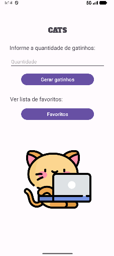

---

````markdown
# 🐱 CatApp – Aplicativo de Gatinhos Aleatórios

## 📖 Descrição do Projeto  

O **CatApp** é um aplicativo Android desenvolvido em **Java** que consome a **The Cat API** para exibir imagens aleatórias de gatos em uma lista.  
O projeto demonstra o uso dos principais conceitos de **Programação para Dispositivos Móveis**, incluindo:

- 📡 Consumo de API com Retrofit (requisições HTTP e JSON)  
- 🧩 Listagem de dados com RecyclerView  
- 🔄 Navegação entre telas com Intents  
- 💾 Persistência de dados com SharedPreferences  
- ⭐ Favoritos interativos com ícones dinâmicos  

O usuário pode:  
- Gerar uma lista com várias imagens aleatórias de gatos 🐾  
- Marcar e desmarcar gatinhos como **favoritos** ⭐  
- Visualizar seus favoritos em uma tela separada  
- Remover favoritos diretamente clicando na estrela  
- Retornar à tela inicial com um botão de voltar  

---

## 🌐 API Utilizada  

### **The Cat API**  
> Base URL: [https://api.thecatapi.com/v1/images/search](https://api.thecatapi.com/v1/images/search)

- Método: `GET`  
- Retorna uma lista JSON com objetos contendo URLs de imagens de gatos.  
- Exemplo de resposta:
```json
[
  {
    "id": "MTY3ODIyMQ",
    "url": "https://cdn2.thecatapi.com/images/abc123.jpg",
    "width": 1080,
    "height": 720
  }
]
````

**Bibliotecas utilizadas:**

* `Retrofit` → para requisições HTTP
* `GsonConverterFactory` → para conversão automática do JSON

---

## ⚙️ Instruções para Executar

### 🧩 Pré-requisitos

* Android Studio instalado
* Emulador Android configurado ou dispositivo físico conectado
* Conexão com a internet

### 🚀 Passo a passo

1. **Clone o repositório:**

   ```bash
   git clone https://github.com/annaSousa8/CatApp.git
   ```

2. **Abra o projeto no Android Studio:**

   ```
   File → Open → selecione a pasta CatApp
   ```

3. **Verifique o Manifest:**
   Certifique-se de que a permissão de internet está habilitada:

   ```xml
   <uses-permission android:name="android.permission.INTERNET" />
   ```

4. **Execute o aplicativo:**

   * Clique em ▶️ “Run App” ou pressione **Shift + F10**
   * Escolha um dispositivo ou emulador Android

5. **Como usar o app:**

   * Digite a quantidade de gatinhos que deseja gerar
   * Clique em **“Descobrir”**
   * Veja os gatinhos carregados via API 🐈
   * Toque na ⭐ para favoritar ou desfavoritar
   * Clique em **“Favoritos”** na tela inicial para ver seus gatos salvos
   * Na tela de Favoritos, toque na estrela para **remover** o gato da lista

---

## 🖼️ Capturas de Tela
| Tela Inicial                                  | Lista de Gatos                                 | Tela de Favoritos                       |
| --------------------------------------------- | ---------------------------------------------- | --------------------------------------- |
|  |  |  |


---


## 🧠 Tecnologias Utilizadas

| Tecnologia            | Função                           |
| --------------------- | -------------------------------- |
| **Java**              | Linguagem principal do projeto   |
| **Android Studio**    | Ambiente de desenvolvimento      |
| **Retrofit**          | Consumo de APIs REST             |
| **Gson**              | Conversão JSON ↔ Objetos Java    |
| **RecyclerView**      | Exibição de listas dinâmicas     |
| **SharedPreferences** | Armazenamento local de favoritos |

---

## 👩‍💻 Autor

**Nome:** *Anna Júlia Sousa*
**Curso:** *Bacharelado em Ciência da Computação – UNIR*
**Disciplina:** *Programação para Dispositivos Móveis*
**Professor:** *Lucas Marques da Cunha*

---

```
